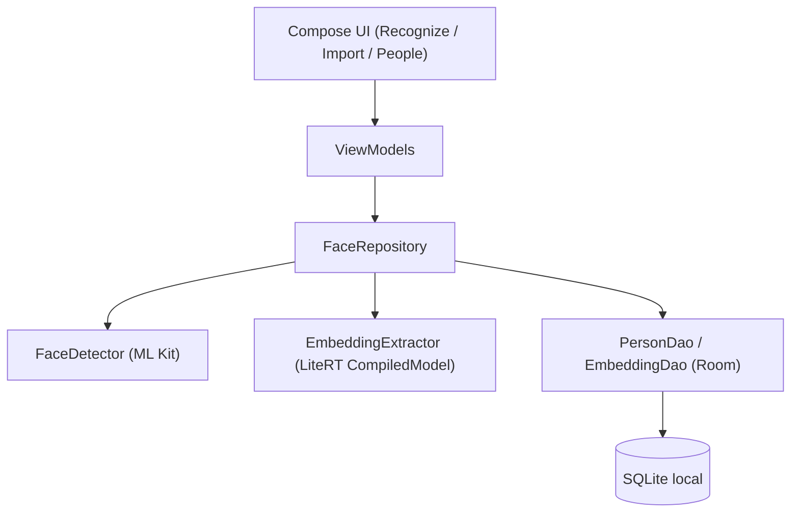

# App Android de reconocimiento facial local con GhostFaceNet

## Contexto y decisiones ya confirmadas
- Modelo: no tienes un `.tflite` propio, así que hay que convertir un checkpoint preentrenado.
- Base de datos: no existe SQLite todavía, solo tienes imágenes en una carpeta local; hay que diseñar el esquema y migrar/importar esas imágenes.
- Proyecto: Android nuevo, creado desde cero en esta carpeta.
- Reconocimiento: identificación 1:N (foto o imagen de galería vs. toda la base de personas guardadas).
- Todo debe correr 100% on-device (sin backend, sin subir imágenes a ningún servidor).

## 1. Preparación del modelo (Python, offline, antes de tocar Android)

Carpeta nueva `model_prep/` (fuera de la app):

- `model_prep/requirements.txt`: `tensorflow`, `keras_cv_attention_models`, `numpy`.
- `model_prep/convert_to_tflite.py`:
  - Descarga el checkpoint `GhostFaceNet_W1.3_S2_ArcFace.h5` (GhostFaceNetV1, width 1.3, stride 2, entrenado con ArcFace sobre MS1MV3) desde el release oficial de [HamadYA/GhostFaceNets](https://github.com/HamadYA/GhostFaceNets/releases/tag/v1.3). Es la variante stride-2 (más rápida, ideal para móvil) con buena precisión (lfw 99.68%, agedb_30 96.92%).
  - Reconstruye la arquitectura (usa `keras_cv_attention_models` / el código del repo) y carga los pesos.
  - Convierte con `tf.lite.TFLiteConverter.from_keras_model(...)`, usando cuantización `float16` (`converter.target_spec.supported_types = [tf.float16]`) — evita los problemas conocidos de cuantizar `PReLU` a int8 y da un `.tflite` ligero (~8 MB) y rápido en CPU.
  - Guarda `ghostfacenet.tflite` (salida: embedding de 512 dimensiones).
  - Incluye un script de validación rápida: correr 2 fotos de la misma persona y 2 de personas distintas, imprimir similitud coseno, para confirmar que el modelo convertido funciona antes de integrarlo.
- El `.tflite` resultante se copia a `app/src/main/assets/ghostfacenet.tflite`.

### Validación realizada (`model_prep/evaluate_lfw.py`)

Se corrió el modelo convertido contra el benchmark estándar LFW (6,000 pares, mismo formato que usa el repo original): **99.717% de accuracy** (similitud media misma-persona 0.657 vs. persona-distinta 0.003, umbral óptimo cos ≈ 0.265), superando el 99.68% reportado en el paper con el checkpoint original. Esto confirma que la conversión a TFLite (arquitectura + preprocesamiento) es correcta. Con este dato se ajustó el umbral por defecto de reconocimiento a `0.30`.

## 2. Proyecto Android (Kotlin + Jetpack Compose)

Dependencias clave:
- `com.google.ai.edge.litert:litert:2.2.0` (LiteRT, sucesor oficial de TensorFlow Lite) con la API `CompiledModel` para correr el `.tflite`.
- `com.google.mlkit:face-detection` (detección de rostro on-device, con landmarks de ojos para alinear).
- CameraX (`camera-camera2`, `camera-lifecycle`, `camera-view`) para tomar fotos.
- `androidx.activity:activity-compose` `PickVisualMedia` (Photo Picker) para elegir de galería sin pedir permiso de almacenamiento.
- Room para la base de datos local (SQLite).
- Coil para mostrar imágenes en Compose.

### Arquitectura



### Esquema de base de datos (Room), diseñado desde cero

- `PersonEntity(id: Long, name: String, referenceImagePath: String, createdAt: Long)`
- `FaceEmbeddingEntity(id: Long, personId: Long, embedding: ByteArray, sourceImagePath: String)`
  - `embedding` guarda el `FloatArray` (512 floats) serializado a bytes.
  - Se guarda un embedding por foto importada (no solo un promedio), y en el matching se toma la similitud máxima por persona — más robusto ante distintas poses/luz.

### Flujo de importación (migrar tu carpeta de fotos a SQLite)

Pantalla "Importar":
1. Selector de carpeta (`ACTION_OPEN_DOCUMENT_TREE`, Storage Access Framework).
2. Convención de organización esperada: una subcarpeta por persona (`Fotos/Juan/1.jpg`, `Fotos/Juan/2.jpg`, `Fotos/Ana/1.jpg`...). Si detecta una carpeta plana sin subcarpetas, usa el nombre de archivo (sin extensión) como nombre de la persona.
3. Por cada imagen: `FaceDetector` (ML Kit) detecta el rostro → alinear usando landmarks de ojos → recortar y redimensionar a 112x112 → normalizar píxeles a rango `[-1, 1]` → `EmbeddingExtractor` (LiteRT) genera el embedding de 512-d → L2-normalizar → guardar `PersonEntity` (si es nuevo) + `FaceEmbeddingEntity`.
4. Mostrar barra de progreso y resumen final (caras importadas OK / imágenes sin rostro detectado, que se reportan para revisión manual).

### Flujo de reconocimiento (identificación 1:N)

Pantalla principal, dos acciones:
- "Tomar foto" → CameraX abre la cámara.
- "Elegir de galería" → Photo Picker.

Pipeline (igual que en importación): detectar → alinear → recortar 112x112 → embedding → L2-normalize.

Matching: consultar todos los `FaceEmbeddingEntity` desde Room, calcular similitud coseno contra el embedding capturado, agrupar por `personId` y quedarse con el máximo. Si el máximo supera un umbral (por defecto `0.30`, validado empíricamente contra el benchmark LFW — ver sección de validación más abajo — y expuesto como ajuste en una pantalla de Settings para que lo calibres con tus propias fotos) → mostrar nombre + foto de referencia + score. Si no → "Persona no reconocida".

### Estructura de archivos propuesta

```
model_prep/
  requirements.txt
  convert_to_tflite.py
  README.md
app/
  build.gradle.kts
  src/main/
    AndroidManifest.xml
    assets/ghostfacenet.tflite
    java/com/example/ghostfacenet/
      GhostFaceNetApp.kt
      MainActivity.kt
      data/
        db/AppDatabase.kt
        db/PersonDao.kt
        db/PersonEntity.kt
        db/FaceEmbeddingEntity.kt
        FaceRepository.kt
      ml/
        FaceDetector.kt        // wrapper de ML Kit
        FaceAligner.kt         // recorte + rotación por landmarks
        EmbeddingExtractor.kt  // wrapper de LiteRT CompiledModel
        FaceMatcher.kt         // similitud coseno / top-match
      ui/
        recognize/RecognizeScreen.kt
        recognize/RecognizeViewModel.kt
        importer/ImportScreen.kt
        importer/ImportViewModel.kt
        people/PeopleListScreen.kt
        settings/SettingsScreen.kt
        navigation/NavGraph.kt
build.gradle.kts
settings.gradle.kts
```

## Consideraciones importantes

- **100% local**: ML Kit Face Detection y LiteRT corren completamente on-device; Room es SQLite local. No hay llamadas de red en ningún flujo.
- **Rendimiento**: el modelo es pequeño (60-275 MFLOPs según el paper), así que una inferencia en CPU debería tomar unas pocas decenas de milisegundos — de sobra para un flujo bajo demanda (no video en tiempo real).
- **Calibración del umbral**: la similitud coseno de corte depende de tus fotos reales; el plan incluye exponerlo como ajuste en vez de un valor fijo en código.
- **Privacidad**: embeddings e imágenes de referencia quedan solo en el almacenamiento privado de la app. Cifrado adicional de la BD (SQLCipher) queda como mejora futura opcional, no incluida en este primer alcance.
- **Permisos**: `CAMERA` para CameraX; la galería usa Photo Picker (`PickVisualMedia`), que en Android 11+ no requiere permiso de almacenamiento.

## Todos de implementación

- [x] **model_prep_script**: Crear `model_prep/convert_to_tflite.py` + `requirements.txt` para descargar el checkpoint GhostFaceNetV1-1.3-2 (ArcFace) y convertirlo a `ghostfacenet.tflite` (float16)
- [x] **project_scaffold**: Crear el proyecto Android (Gradle, Compose, manifest, dependencias: ML Kit, Room, Coil). Nota: se usó `org.tensorflow:tensorflow-lite` (Interpreter) en vez de LiteRT `CompiledModel`, y captura con `ActivityResultContracts.TakePicturePreview` en vez de CameraX — mismo resultado (100% local), menos dependencias.
- [x] **db_layer**: Implementar Room: `PersonEntity`, `FaceEmbeddingEntity`, `FaceDao` y `AppDatabase`
- [x] **face_pipeline**: Implementar `FaceDetector` (ML Kit) y `FaceAligner` (recorte/alineación a 112x112)
- [x] **embedding_engine**: Implementar `EmbeddingExtractor` (TFLite `Interpreter`) y `FaceMatcher` (similitud coseno)
- [x] **import_flow**: Implementar `ImportScreen`/`ImportViewModel` para migrar la carpeta de fotos a la base de datos local
- [x] **recognize_flow**: Implementar `RecognizeScreen`/`RecognizeViewModel`: captura por cámara o galería y matching 1:N
- [x] **ui_polish**: Implementar navegación, `PeopleListScreen`, `SettingsScreen` (umbral) y manejo de permisos

## Estado actual

Build de debug compila y corre correctamente en dispositivo (confirmado por el usuario, 21/8/2026). Los 8 todos del plan original están completos: el pipeline completo (detección → alineación → embedding → matching) funciona de punta a punta con persistencia en Room.

### Posibles siguientes pasos (no confirmados todavía, a decidir)
- Pulido de UX: mostrar miniatura/foto de referencia en el resultado de reconocimiento, permitir borrar personas/fotos desde `PeopleListScreen`, mostrar más de una foto por persona.
- Manejo de errores más visible (hoy `loadBitmap`/`loadBitmapFromUri` tragan excepciones silenciosamente).
- Build de release: firma (`signingConfig`), `isMinifyEnabled = true` + reglas ProGuard/R8 verificadas contra ML Kit/TFLite, generar APK/AAB firmado.
- Opcional: cifrado de la BD local (SQLCipher), mencionado en el plan original como mejora futura.
- Limpieza: `model_prep/checkpoints`, `model_prep/datasets`, `model_prep/output` son artefactos pesados generados localmente — confirmar que están en `.gitignore` antes de versionar.

## 3. Prueba manual de punta a punta con dataset real (en curso)

Hasta ahora solo se había validado el modelo en Python contra pares ya alineados de
LFW (`model_prep/evaluate_lfw.py`, 99.717%). Eso confirma que la conversión a
TFLite es correcta, pero **no** ejerce el pipeline real de la app (detección con
ML Kit, alineación por landmarks de ojos, recorte 112x112, Room). Para probar
eso se armó un dataset de prueba en `test_data/`:

- `test_data/prepare_test_set.py`: descarga manual previa de LFW (mirror de
  figshare, ya que el sitio oficial de UMass no resuelve) y organiza un
  subconjunto en:
  - `enroll/<Persona>/` — 12 personas, 3 fotos cada una. Se importan con la
    pantalla "Importar".
  - `probe_known/<Persona>/` — fotos DE LAS MISMAS 12 personas (3 a 29 según
    disponibilidad en LFW), nunca importadas. Deben reconocerse correctamente.
  - `probe_unknown/<Persona>/` — 6 personas que nunca se importan. Deben salir
    como "Persona no reconocida".
- Ya se copiaron ambas carpetas (`enroll`, `probe_known`, `probe_unknown`) a
  `/sdcard/GhostFaceNetTest/` en los dos dispositivos conectados (físico
  `R28M40244SL` y emulador `emulator-5554`) vía `adb push`.
- Se agregó un botón **"Elegir archivo"** en `RecognizeScreen` (usa
  `ActivityResultContracts.OpenDocument`, SAF) porque el Photo Picker de
  galería no siempre muestra fotos copiadas por `adb push` hasta que
  MediaStore las indexa; el selector de archivos lee del sistema de archivos
  directamente y siempre las muestra. APK actualizado ya reinstalado en ambos
  dispositivos.

### Protocolo de prueba (a ejecutar manualmente en la app)

1. Pestaña **Importar** → "Elegir carpeta" → navegar a
   `GhostFaceNetTest/enroll` (almacenamiento interno) → confirmar que el
   resumen diga 12 personas / 36 fotos importadas, 0 sin rostro (o revisar
   cuáles fallaron).
2. Pestaña **Personas** → confirmar que aparecen las 12 personas con su foto
   de referencia.
3. Pestaña **Reconocer** → "Elegir archivo" → navegar a
   `GhostFaceNetTest/probe_known/<Persona>/` → elegir una foto → debe
   reconocer a esa persona con similitud ≥ umbral (0.30 por defecto). Repetir
   con varias personas/fotos de esta carpeta.
4. Pestaña **Reconocer** → "Elegir archivo" → navegar a
   `GhostFaceNetTest/probe_unknown/<Persona>/` → debe salir "Persona no
   reconocida". Repetir con las 6 personas.
5. Opcional: repetir el punto 3 con "Elegir de galería" en vez de "Elegir
   archivo" (puede requerir reiniciar el dispositivo una vez para que
   MediaStore indexe las fotos copiadas por adb).
6. Anotar cualquier falso negativo (personas conocidas no reconocidas) o falso
   positivo (desconocidos reconocidos como alguien) — puede ajustarse el
   umbral desde **Ajustes** si hace falta recalibrar.

- [ ] **e2e_dataset_test**: Ejecutar el protocolo anterior en dispositivo real
  y/o emulador, y registrar resultados (aciertos/fallos) en este documento.
